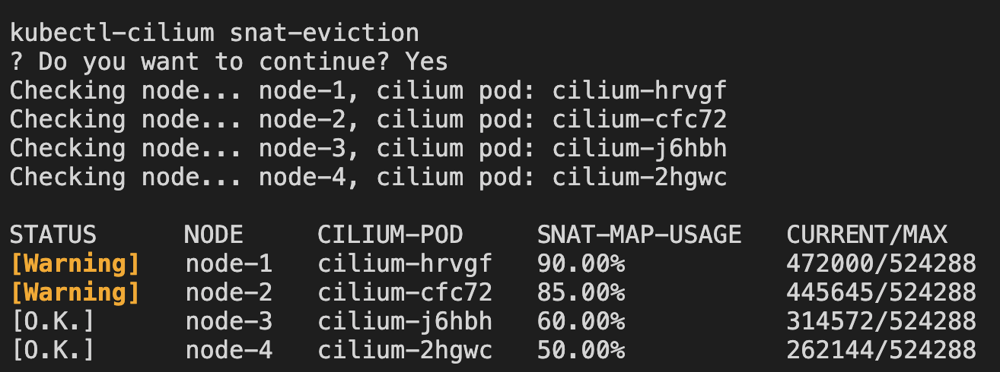

<h1 align="center">kubectl-cilium</h1>

A CLI for kubernetes that helps you scan and monitor BPF map usage across all nodes managed by Cilium.
This tool is designed to help cluster administrators proactively detect and address BPF map high eviction rates, such as a large number of active connections. If any nodes are identified as being at risk and encounter network issues, Please consider increasing the `--bpf-map-dynamic-size-ratio` parameter in the Cilium configuration.

For more details, please refer to: https://github.com/cilium/cilium/pull/37747

---

## Installation

### Prerequisites

- Go 1.24.2+ (for building from source)
- Access to a Kubernetes cluster with Cilium CNI

### Install via Go

```
go install github.com/kakao/kubectl-cilium@latest
```

### Build from Source

```
make run
```

---

## Usage

### Scan BPF map usage acress all nodes

```
kubectl-cilium bpf-map-pressure
```

### Scan BPF map usage for a specific node

```
kubectl-cilium bpf-map-pressure --node <node-name>
```

### Use a custom kubeconfig

```
kubectl-cilium bpf-map-pressure --kubeconfig /path/to/kubeconfig
```

## Example output

```
kubectl-cilium bpf-map-pressure
? This command create inspector pods on all nodes to check BPF map pressure. And it may consume CPU resource (200m core limit)
Do you want to continue? Yes
Inspecting node... node-1
Inspecting node... node-2
Inspecting node... node-3
Created inspector pod: bpf-inspector-node-1
Created inspector pod: bpf-inspector-node-2
Created inspector pod: bpf-inspector-node-3
Inspecting BPF map... cilium_nodeport_neigh4 in node: node-1
Inspecting BPF map... cilium_snat_v4_external in node: node-2
Inspecting BPF map... cilium_ct_any4_global in node: node-3

STATUS      NODE        MAP                       USAGE    CURRENT/MAX
[Warning]   node-1      cilium_ct4_global         80.08%   284970/356212
[O.K.]      node-1      cilium_nodeport_neigh4    0.00%    0/356212
[O.K.]      node-1      cilium_snat_v4_external   0.47%    1686/356212
[O.K.]      node-2      cilium_nodeport_neigh4    0.00%    1/356212
[O.K.]      node-2      cilium_snat_v4_external   4.10%    14606/356212
[O.K.]      node-2      cilium_ct4_global         0.16%    571/356212
[O.K.]      node-3      cilium_nodeport_neigh4    0.00%    1/356212
[O.K.]      node-3      cilium_snat_v4_external   0.96%    3410/356212
[O.K.]      node-3      cilium_ct4_global         0.13%    446/356212

If you see [Warning] status in the output and encounter network issues,
Please consider increasing --bpf-map-dynamic-size-ratio in cilium-agent configuration.
```

## Features

- Scan BPF map usage across all nodes
- Scan SNAT map usage across all nodes or a specific node
- Custom kubeconfig support
- Clear status output with warning thresholds

---
## License
This software is licensed under the Apache 2 license, quoted below.

Copyright 2025 Kakao Corp. http://www.kakaocorp.com

Licensed under the Apache License, Version 2.0 (the "License"); you may not use this project except in compliance with the License. You may obtain a copy of the License at http://www.apache.org/licenses/LICENSE-2.0.

Unless required by applicable law or agreed to in writing, software distributed under the License is distributed on an "AS IS" BASIS, WITHOUT WARRANTIES OR CONDITIONS OF ANY KIND, either express or implied. See the License for the specific language governing permissions and limitations under the License.
